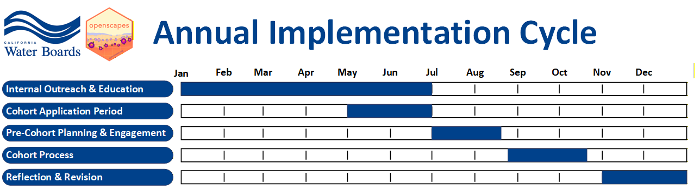
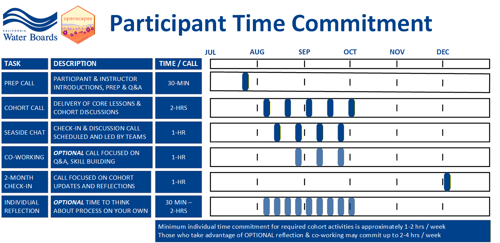

The successful implementation of the [Champions Program](https://www.openscapes.org/champions/) at the Water Boards requires intentional actions that balance our desire to rapidly diffuse the insights and benefits of the Openscapes Champions Program throughout the Water Boards and the reality of limited Program and implementation resources (e.g., staff time, funding). To maintain this balance, the Champions Program will be implemented through an annual cycle that will include five phases:

1.  Internal Outreach and Education
2.  Cohort Application Period
3.  Pre-cohort Planning and Engagement
4.  Cohort Process
5.  Reflection and Revision

{fig-alt="Monthly Gantt chart of the Openscapes Annual Cycle, which consists of 5 phases. Internal outreach occurs in January-June. The application period occurs in May-June. Pre-cohort Planning and engagement occurs from July to mid-August. The cohort process occurs from late August to late October. Reflection and revision occurs in November and December."}

## Internal Outreach and Education

*\~6 months (Jan - Jun)*

The Openscapes Champions process and mindset is new to the Water Boards, and has only really been exposed to individuals and programs that have direct connection to the pilot efforts. The Water Boards Openscapes Team will use this time to present about this work and its future in our organization to management, internal roundtables, all staff meetings, and work groups, as well as hold Office Hours where Water Boards Staff interested in joining an upcoming Champions Cohort can ask questions and determine if joining Openscapes this year will be a good fit.

## Cohort Application Period

*\~2 months (May - Jun)*

During this time, we will invite individuals and team leads to nominate themselves or their teams for the upcoming Water Boards Openscapes Cohort(s) by completing a relatively simple application. The Microsoft Form Application will remain open for about 2 months and will be used to:

-   gather applicant contact information
-   get an understanding of the applicant's interest in and readiness to participate in an upcoming Water Boards Openscapes Cohort
-   confirm that the applicant and their team members (as appropriate) have approval to participate in the cohort
-   confirm that the applicant and their team members (as appropriate) will commit to attending all mandatory call dates/times

While Openscapes works to level power structures within teams, at this stage, the applicants (frequently supervisors) are critical liaisons between the Openscapes instructors and their team members for scheduling and communication purposes. As a part of these application requirements, we expect applicants to introduce their team members to Openscapes in whatever way makes sense to them -- for example, by attending one of the Outreach and Education events, discussing Openscapes in a team meeting, and/or providing an introduction to Openscapes background and materials via email. We are looking for individuals and teams that are ready and excited to participate and will not be surprised by an invitation to join an Openscapes Cohort.

## Pre-cohort Planning and Engagement

*\~1.5 months (Jul - mid-Aug)*

About 1 month before each cohort start date, the Water Boards Openscapes Team will review the applicant nominations and select the individuals and teams that will be invited to participate in the upcoming cohort. All applicants will be notified of whether they were selected for the upcoming cohort. Applicants that are invited to participate in the upcoming cohort will have 1 week to confirm their participation. Once confirmed, the applicants and their team members (as appropriate) will be emailed congratulating them on their selection for the incoming cohort and requesting them to book a short Prep Call with the Cohort instructors. The Prep Calls will help individuals and/or team members and instructors to start getting to know each other, share more details about the Champions Program, learn about the applicant(s), how they work, their goals for the Cohort, and answer any questions.

Approximately 3 weeks before the beginning of the Cohort, teams will be sent a welcome email that contains information about the upcoming cohort and how they can prepare, as well as calendar invitations to all upcoming Cohort Calls (mandatory), Co-working Sessions (optional), and a hold for the 2-month check-in post-cohort.

Approximately 1 week before the start of the Cohort, teams will be emailed a Cohort Call reminder and a few action items that individuals need to complete before the start of the Cohort.

During this phase, the Water Boards Openscapes Team will also:

-   Work with the external and internal Openscapes communities to identify, invite, and coordinate guest teachers to present topics during Cohort Calls.
-   Set up all necessary documentation (e.g., Cohort sharing folders, Cohort Call agendas, GitHub repositories, lesson plans and presentations).
-   Invite all incoming team members to the internal Water Boards Openscapes Microsoft Team so they can introduce themselves to the Water Boards Openscapes Community.
-   Invite and onboard identified Openscapes mentors to the Openscapes Team, as appropriate.

## Cohort Process

*9 weeks (late Aug - late Oct)*

Cohorts will be composed of:

-   2 instructors, who will lead calls and content
-   no more than 4 mentors, who will support calls and develop call summaries (digests)
-   around 40 participants composed of individuals or teams with no more than 6 individuals per team

Selected teams will participate as a Champions Cohort over the course of 9 weeks. During that time they will attend mandatory Cohort Calls and Seaside Chats, and may also attend optional Co-working Sessions. See the indivdual [cohort pages](https://cawaterboarddatacenter.github.io/swrcb-openscapes/cohorts/) for specific dates and times of mandatory meetings.

{fig-alt="weekly Gantt chart visualization of the cohort process. Prep calls are 30-minute participant and instructor get-to-know-you calls which occur a few weeks before cohorts begin. Cohort calls are 2-hours, Champions Program session with the whole cohort. They occur on every other week for 5 sessions starting in mid-August and ending in Mid-October. Seaside chats are 1-hour calls scheduled and lead by each team, which occur on alternating weeks from Cohort calls. Co-working sessions are optional, 1-hour remote co-working with the cohort occurring on alternating weeks from Cohort calls. The 2-month check-in is a 1-hour meeting in December when the cohort re-convenes to share and reflect team process. Individual reflection is 30 min to 2 hours of optional, weekly time to think about the process on your own. Minimum individual time commitment for required cohort activities is approximately 1-2 hrs per week. Those who take advantage of OPTIONAL reflection & co-working may commit up to 2-4 hrs per week."}

**Cohort Calls** are [mandatory 2-hour meetings]{.underline} where the bulk of content is delivered to all teams in the Cohort. The topics covered during lessons include: the Openscapes mindset, team culture, GitHub, as well as data, documentation and workflow strategies for "future us". Openscapes publishes the [lessons for each meeting](https://openscapes.github.io/series/). However, the Water Boards Openscapes Team has customized content and the order of topics in each Cohort Call to better serve the current Water Boards framework and needs. The specific content, activities, and discussions of each call is different but generally have the following core structure:

-   Roll call with ice breaker
-   Welcome with Code of Conduct reminder
-   Lesson with activity 1
-   Lesson with activity 2
-   Closing reflections, efficiency and equity tips, and reminders

**Seaside Chats** are [mandatory 1-hour meetings]{.underline} that are scheduled and led by each team. This time is for teams to meet, outside of the full cohort, so that they can reflect on past cohort meetings or prepare for an upcoming cohort meeting. It is a time for the team to share questions they have, follow-up on call topics, and/or work on their shared Pathway Spreadsheet.

**Co-working Sessions** are [optional 1-hour meetings]{.underline} that are scheduled by the Water Boards Openscapes Team. This is a time for individuals and teams to come together outside of the formal Cohort Calls and Seaside Chats to practice building and implementing skills and principles that are discussed during the Cohort Calls.

It is also recommended that individuals allocate [approximately 1 hour per week]{.underline} to **individual reflection and work** related to the Openscapes process. Although the amount of time an individual may be able to dedicate to this may range from zero hours to two hours per week, depending on their interest and capacity.

The aggregate time participants will need to commit to the Cohort Process comes out to approximately 1-4 hours per week, depending on whether they take part in optional Co-working Sessions and how Cohort Calls and Seaside Chats fall on their calendars.

## Reflection and Revision

*2 months (Nov-Dec)*

During or shortly after the last Cohort Call, individuals will be asked to complete a brief survey to provide formal feedback (anonymous or named) on their Openscapes Champions Program experience.

Approximately 2-months after the last Cohort Call, Teams will meet for one final 1-hour Cohort Call with other members of the cohort to reflect on how things have been going over the past two months, and to share any challenges, successes, and vision for how they will continue operationalizing the open science principles discussed during the Openscapes Cohort process.

During this phase, the Water Boards Openscapes Team will also:

-   Review and reflect on the results of the survey. The detailed feedback shared during this survey will be shared with the Water Boards Openscapes Team, Openscapes leadership to help improve Openscapes at the Water Boards and as a whole so we can grow our community and better support each other. We would like to share survey results with Water Boards management, including support needs for continued open science work. Generalized and/or anonymized feedback and key lessons may be shared to the broader Openscapes Community.
-   Plan for the next year's Openscapes process, including adjusting or revising any of the phases outlined above to improve the process and experience for the next cohort.
