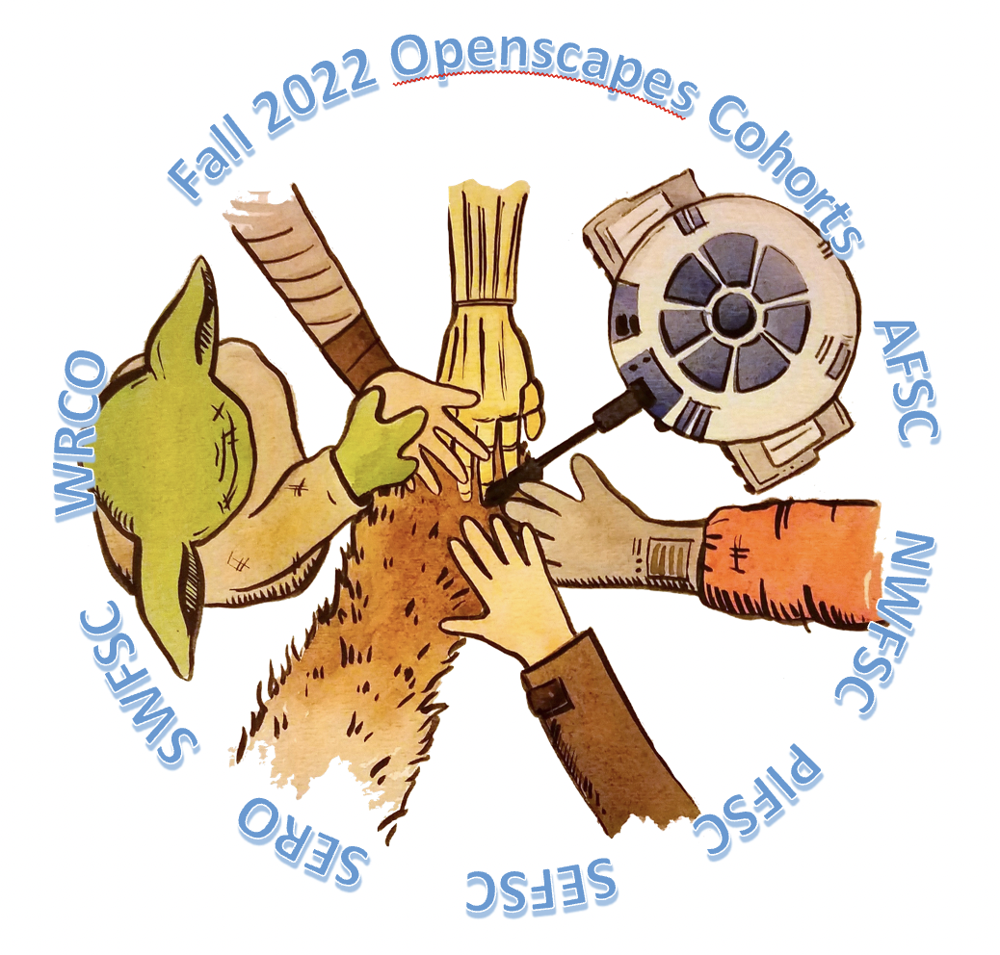

October to December 2022, we will have four Champions Cohorts involving teams and staff from five science centers and two regional offices: AFSC, NWFSC, PIFSC, SEFSC, SERO, SWFSC and WCRO.

::: {.callout-note icon=false}

## Contact your Openscapes contact person for more information

Each center is currently working with Openscapes to finalize the participant lists for each of the four cohorts. Please contact [your Openscapes mentor/point-of-contact](../mentors.html) for more information on participation. We are in the early stages of  planning additional joint activities (such as talks, workshops, presentations, theme-based co-working sessions) across the four cohorts.

:::