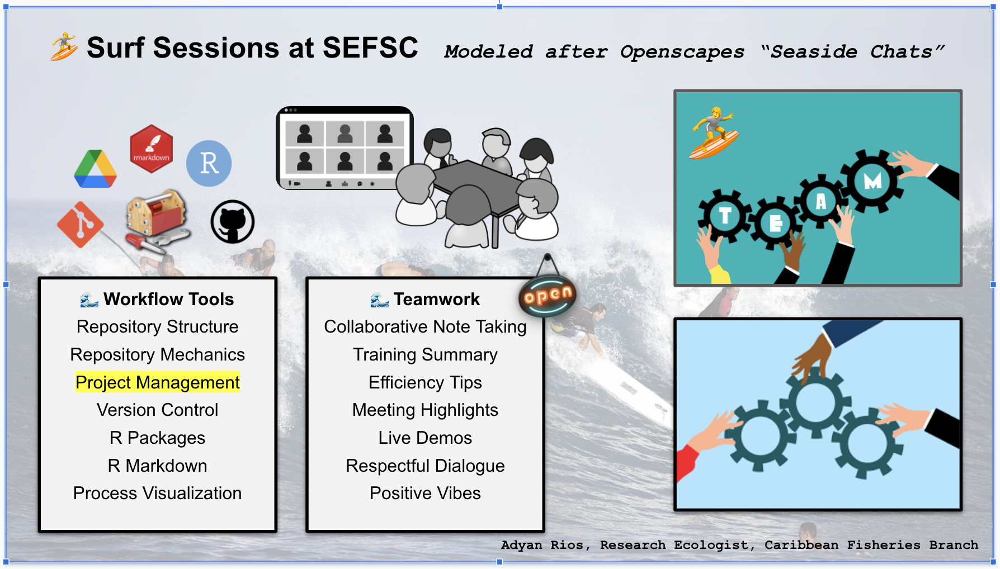

In recent years, the Southeast Fisheries Science Center (SEFSC) completed a functional realignment. New divisons, branches, and matixed teams have been established, giving rise to unique opportunities for redefining work culture and workflows. 

There are 36 people from SEFSC and 4 people from AOML participating in the 2022 SEFSC Summer Cohort of the Openscapes Champions training program.  This includes 5 people who previously participated in the Fall 2021 NMFS Cohort who are now helping to lead teams in the current cohort. There are 9 supervisors participating, 8 from SEFSC and 1 from AOML.  Within SEFSC, there's a large group from the Sustainable Fisheries Division, with 100% of staff from 3 branches: Caribbean, Gulf, and Data Analysis & Assessment Support.  There are 4 SEFSC participants from Operations, Management and Information, who will strengthen their own workflows while gaining an increased understanding of current (and future) science workflows at SEFSC.

This cohort training is taking place over 5 remote calls from June 30 to August 25, 2022. Cohort calls will cover: 

1) setting the open science mindset and discussing psychological safety, 
2) an introduction to publishing and project management on GitHub, 
3) instituting team culture and data strategies, 
4) developing open communities and coding strategies, and 
5) preparing a team pathway document to guide their open data science journey after the training. 

In direct alignment with SEFSC strategic initiatives, the Summer SEFS Openscapes cohort is advancing innovation and operational best practice processes. The teams are focusing their energy on a range of important research issue while developing their skills to cultivate innovation and establish best practices in their own work.  All of this is achieved within the context of a growing expansion of open science within NOAA and the greater scientific community. 

*SEFSC Openscapes Summer 2022 planning team:*  Adyan Rios;, Molly Stevens, James Primrose, Erica Rule. 

# Teams

**The Advanced Technology Team** 

**The Biology and Life History Team** 

**The Caribbean Team** 

**The Data Analysis and Assessment Support Team** 

**The IEA Team** 

**The Assessment Workflow Team** 

**The Data Governance Team** 

**The Data Workflows and Project Management Team** 

**The Fisheries Statistics Team** 

# Continued support

At the conclusion of the training, cohort members are encouraged to share their hopes for how the SEFSC will continue to support and enhance open data science within our community. Their responses will be summarized below.
