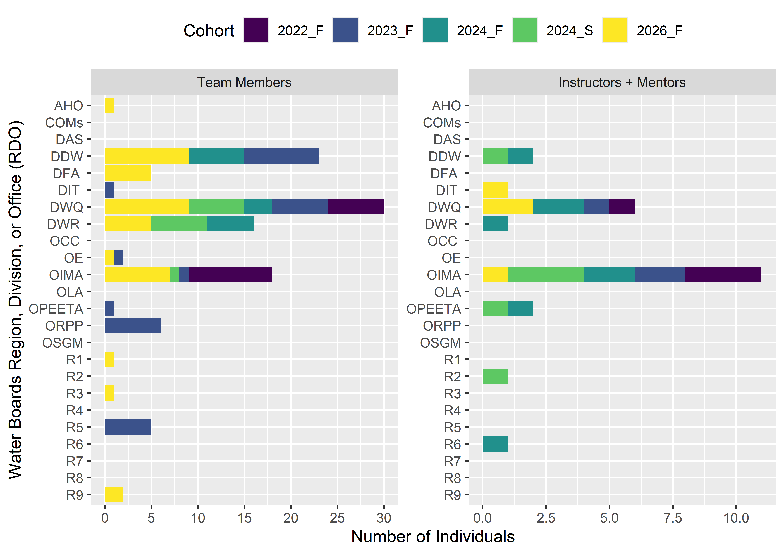

## Champions Cohorts

The Water Boards Openscapes Champions Program is a mentorship and professional development opportunity for individuals and teams at the Water Boards.

### Current and Upcoming Cohorts

The [Fall 2026 Cohort](https://cawaterboarddatacenter.github.io/swrcb-openscapes/cohorts/swrcb_2026T.html) will run from mid-August through mid-October 2026.

### Water Boards Cohorts Summary

+------------------------------------------------------------------------+-------------------------------------------------------------------------------------------------+-------------------------------------------------------------------------------------------------+---------------------------------------------------------------------------------------------------+------------------------------------------------------------------------------------------------+------------------------------------------------------------------------------------------------+
| Cohort                                                                 | [2026 Fall](https://cawaterboarddatacenter.github.io/swrcb-openscapes/cohorts/swrcb_2026T.html) | [2024 Fall](https://cawaterboarddatacenter.github.io/swrcb-openscapes/cohorts/swrcb_2024F.html) | [2024 Spring](https://cawaterboarddatacenter.github.io/swrcb-openscapes/cohorts/swrcb_2024S.html) | [2023 Fall](https://cawaterboarddatacenter.github.io/swrcb-openscapes/cohorts/swrcb_2023.html) | [2022 Fall](https://cawaterboarddatacenter.github.io/swrcb-openscapes/cohorts/swrcb_2022.html) |
+=======================================================================:+=================================================================================================+=================================================================================================+===================================================================================================+================================================================================================+================================================================================================+
| Number of Teams                                                        | 7                                                                                               | 3                                                                                               | 3                                                                                                 | 6                                                                                              | 3                                                                                              |
+------------------------------------------------------------------------+-------------------------------------------------------------------------------------------------+-------------------------------------------------------------------------------------------------+---------------------------------------------------------------------------------------------------+------------------------------------------------------------------------------------------------+------------------------------------------------------------------------------------------------+
| Number of Individuals                                                  | 11                                                                                              | NA                                                                                              | NA                                                                                                | NA                                                                                             | NA                                                                                             |
+------------------------------------------------------------------------+-------------------------------------------------------------------------------------------------+-------------------------------------------------------------------------------------------------+---------------------------------------------------------------------------------------------------+------------------------------------------------------------------------------------------------+------------------------------------------------------------------------------------------------+
| **Total Number of Participants in Cohort**                             | **45**                                                                                          | **22**                                                                                          | **19**                                                                                            | **31**                                                                                         | **19**                                                                                         |
|                                                                        |                                                                                                 |                                                                                                 |                                                                                                   |                                                                                                |                                                                                                |
| (Team Members, Individuals, Mentors, Instructors)                      |                                                                                                 |                                                                                                 |                                                                                                   |                                                                                                |                                                                                                |
+------------------------------------------------------------------------+-------------------------------------------------------------------------------------------------+-------------------------------------------------------------------------------------------------+---------------------------------------------------------------------------------------------------+------------------------------------------------------------------------------------------------+------------------------------------------------------------------------------------------------+
| Percent Water Boards Regions, Divisions, or Offices (RDOs) Represented | 46%                                                                                             | 25%                                                                                             | 25%                                                                                               | 33%                                                                                            | 8%                                                                                             |
+------------------------------------------------------------------------+-------------------------------------------------------------------------------------------------+-------------------------------------------------------------------------------------------------+---------------------------------------------------------------------------------------------------+------------------------------------------------------------------------------------------------+------------------------------------------------------------------------------------------------+
| Number of RDOs Represented                                             | 11                                                                                              | 6                                                                                               | 6                                                                                                 | 8                                                                                              | 2                                                                                              |
+------------------------------------------------------------------------+-------------------------------------------------------------------------------------------------+-------------------------------------------------------------------------------------------------+---------------------------------------------------------------------------------------------------+------------------------------------------------------------------------------------------------+------------------------------------------------------------------------------------------------+

+-------------------------+------------------------------------------------------------------------------------------------------------------------------------------+
| Acronym or Abbreviation | Definition                                                                                                                               |
+=========================+==========================================================================================================================================+
| RDO                     | Water Boards [R]{.underline}egion, [D]{.underline}ivision, or [O]{.underline}ffice                                                       |
+-------------------------+------------------------------------------------------------------------------------------------------------------------------------------+
| AHO                     | [A]{.underline}dministrative [H]{.underline}earings [O]{.underline}ffice                                                                 |
+-------------------------+------------------------------------------------------------------------------------------------------------------------------------------+
| COMs                    | [Com]{.underline}munication[s]{.underline} Office                                                                                        |
+-------------------------+------------------------------------------------------------------------------------------------------------------------------------------+
| DAS                     | [D]{.underline}ivision of [A]{.underline}dministrative [S]{.underline}ervices                                                            |
+-------------------------+------------------------------------------------------------------------------------------------------------------------------------------+
| DDW                     | [D]{.underline}ivision of [D]{.underline}rinking [W]{.underline}ater                                                                     |
+-------------------------+------------------------------------------------------------------------------------------------------------------------------------------+
| DFA                     | [D]{.underline}ivision of [F]{.underline}inancial [A]{.underline}ssistance                                                               |
+-------------------------+------------------------------------------------------------------------------------------------------------------------------------------+
| DIT                     | [D]{.underline}ivision of [I]{.underline}nformation [T]{.underline}echnology                                                             |
+-------------------------+------------------------------------------------------------------------------------------------------------------------------------------+
| DWQ                     | [D]{.underline}ivision of [W]{.underline}ater [Q]{.underline}uality                                                                      |
+-------------------------+------------------------------------------------------------------------------------------------------------------------------------------+
| DWR                     | [D]{.underline}ivision of [W]{.underline}ater [R]{.underline}ights                                                                       |
+-------------------------+------------------------------------------------------------------------------------------------------------------------------------------+
| OCC                     | [O]{.underline}ffice of [C]{.underline}hief [C]{.underline}ounsel                                                                        |
+-------------------------+------------------------------------------------------------------------------------------------------------------------------------------+
| OE                      | [O]{.underline}ffice of [E]{.underline}nforcement                                                                                        |
+-------------------------+------------------------------------------------------------------------------------------------------------------------------------------+
| OIMA                    | [O]{.underline}ffice of [I]{.underline}nformation [M]{.underline}anagement and [A]{.underline}nalysis                                    |
+-------------------------+------------------------------------------------------------------------------------------------------------------------------------------+
| OLA                     | [O]{.underline}ffice of [L]{.underline}egislative [A]{.underline}ffairs                                                                  |
+-------------------------+------------------------------------------------------------------------------------------------------------------------------------------+
| OPEETA                  | [O]{.underline}ffice of [P]{.underline}ublic [E]{.underline}ngagement, [E]{.underline}quity & [T]{.underline}ribal [A]{.underline}ffairs |
+-------------------------+------------------------------------------------------------------------------------------------------------------------------------------+
| ORPP                    | [O]{.underline}ffice of [R]{.underline}esearch, [P]{.underline}lanning, and [P]{.underline}erformance                                    |
+-------------------------+------------------------------------------------------------------------------------------------------------------------------------------+
| OSGM                    | [O]{.underline}ffice of [S]{.underline}ustainable [G]{.underline}roundwater [M]{.underline}anagement                                     |
+-------------------------+------------------------------------------------------------------------------------------------------------------------------------------+
| R1                      | [R]{.underline}egion [1]{.underline} -- North Coast Regional Water Quality Control Board                                                 |
+-------------------------+------------------------------------------------------------------------------------------------------------------------------------------+
| R2                      | [R]{.underline}egion [2]{.underline} -- San Francisco Regional Water Quality Control Board                                               |
+-------------------------+------------------------------------------------------------------------------------------------------------------------------------------+
| R3                      | [R]{.underline}egion [3]{.underline} -- Central Coast Regional Water Quality Control Board                                               |
+-------------------------+------------------------------------------------------------------------------------------------------------------------------------------+
| R4                      | [R]{.underline}egion [4]{.underline} -- Los Angeles Regional Water Quality Control Board                                                 |
+-------------------------+------------------------------------------------------------------------------------------------------------------------------------------+
| R5                      | [R]{.underline}egion [5]{.underline} -- Central Valley Regional Water Quality Control Board                                              |
+-------------------------+------------------------------------------------------------------------------------------------------------------------------------------+
| R6                      | [R]{.underline}egion [6]{.underline} -- Lahontan Regional Water Quality Control Board                                                    |
+-------------------------+------------------------------------------------------------------------------------------------------------------------------------------+
| R7                      | [R]{.underline}egion [7]{.underline} -- Colorado River Regional Water Quality Control Board                                              |
+-------------------------+------------------------------------------------------------------------------------------------------------------------------------------+
| R8                      | [R]{.underline}egion [8]{.underline} -- Santa Ana Regional Water Quality Control Board                                                   |
+-------------------------+------------------------------------------------------------------------------------------------------------------------------------------+
| R9                      | [R]{.underline}egion [9]{.underline} -- San Diego Regional Water Quality Control Board                                                   |
+-------------------------+------------------------------------------------------------------------------------------------------------------------------------------+
| Water Boards            | California State Water Resources Control Board and Regional Water Quality Control Boards, collectively                                   |
+-------------------------+------------------------------------------------------------------------------------------------------------------------------------------+

: Water Boards Region, Division, or Office Acronyms or Abbreviations and their definitions
