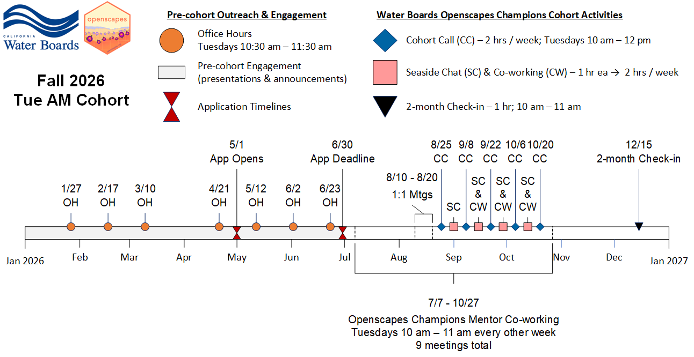

::: callout-tip
## Apply to join a Fall 2026 Cohort by Jun 30, 2026!

The [Openscapes at the Water Boards](https://cawaterboarddatacenter.github.io/swrcb-openscapes/) Team is excited to invite individuals and teams at the Water Boards to apply to participate in an [Openscapes Champions Cohort](https://cawaterboarddatacenter.github.io/swrcb-openscapes/cohorts/) this fall! **If you are looking to increase open and inclusive science practices in your work, this is the opportunity for you!**

[Before you apply, be sure to review:]{.underline}

-   [Am I ready to participate in a Champions Cohort?](https://cawaterboarddatacenter.github.io/swrcb-openscapes/cohorts/team_guidance.html)
-   [Am I ready to be an Openscapes Mentor?](https://cawaterboarddatacenter.github.io/swrcb-openscapes/mentors/mentor_guidance.html)
-   Fall 2026 Cohort Timelines - make sure you're available during mandatory cohort calls
    -   [Tue AM Cohort](https://cawaterboarddatacenter.github.io/swrcb-openscapes/cohorts/swrcb_2026T.html) will meet on Tuesdays from 10 am - 12 pm
    -   [Wed PM Cohort](https://cawaterboarddatacenter.github.io/swrcb-openscapes/cohorts/swrcb_2026W.html) will meet on Wednesdays from 2 pm - 4 pm

[Do you still have questions? Join an upcoming [Openscapes Office Hour](#0)!]{.underline}

-   Office Hours are from 10:30 am - 11:30 am on the following Tuesdays - Apr 21, May 12, Jun 2, Jun 23
-   All office hours are held via MS Teams ([join link](https://teams.microsoft.com/l/meetup-join/19%3ameeting_MmVjZDFhMDEtMjU1NS00ZmQ1LWE5YjktM2Q0NDJlN2QzNzY2%40thread.v2/0?context=%7b%22Tid%22%3a%22fe186a25-7d49-41e6-9941-05d2281d36c1%22%2c%22Oid%22%3a%22b80729e4-c1b6-4598-b868-8c4da13c5db8%22%7d))
-   Office Hours are open to all Water Boards Staff interested in joining future Champions Cohorts as a participant or mentor to ask questions and determine if joining a cohort is a good fit for them/their team.

**Nominate yourself or your team by filling out this [Microsoft Form](https://forms.cloud.microsoft/g/cqVP38yC7L) by June 30th, 2026.**

We will confirm participation in early July.
:::

*Cohort Instruction Team:* Anna Holder (OIMA), Tina Ures (DWQ)

*Cohort Mentors:* TBD

*Guest Teachers:* TBD

-   Cohort GitHub Webpage \| Repository TBD

On Tuesday mornings in mid-August - mid-October 2026, the Water Boards cohort instructors and mentors will lead the fifth Openscapes Champions Cohort at the Water Boards!

The 2026 Tuesday AM Champions Cohort Individuals and/or Teams include:

-   TBD

See the timeline below for dates of mandatory Cohort activities:

{fig-alt="Timeline displaying milestones for the implementation of the 2026 Tue. AM Water Boards Cohort: Jan through Jun pre-cohort engagement (including office hours), Jun 30 Application Deadline, Aug 10-20 1:1 meetings, Cohort calls on Aug 25, Sep 8, Sep 22, Oct 6, Oct 20, with seaside chats and co-working sessions scheduled on weeks alternate to Cohort calls, and the 2-month check-in scheduled for Dec 15"}
