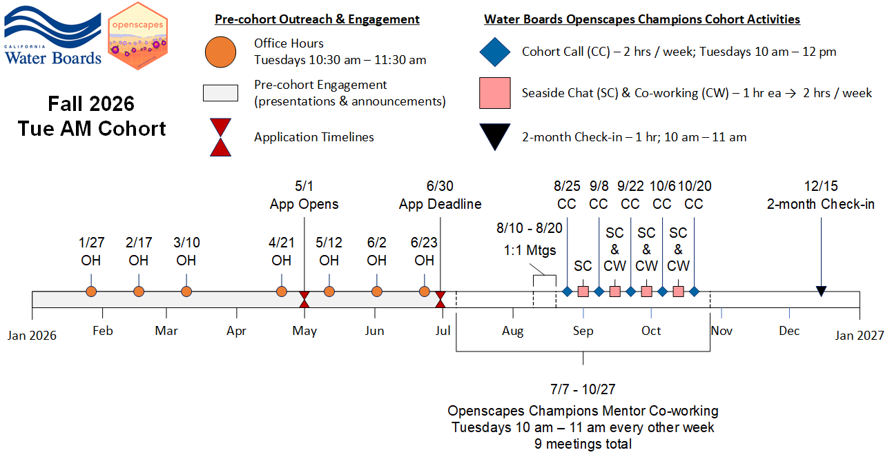

*Cohort Instruction Team:* Anna Holder (OIMA), Tina Ures (DWQ)

*Cohort Mentors:* Magnolia Busse (DWQ), John Herrera (DIT)

*Guest Teachers:* [Shannon Rankin](https://shannonrankin.github.io/me/) (NOAA Fisheries), [Gregor Siegmund](https://gregor-fausto.github.io/) (UCLA), Rachael Blake & Kate Wing (Intertidal)

Cohort GitHub [Webpage](https://openscapes.github.io/2026-swrcb-fall/) \| [Repository](https://github.com/Openscapes/2026-swrcb-fall)

On Tuesday mornings in mid-August - mid-October 2026, the Water Boards cohort instructors and mentors will lead the fifth Openscapes Champions Cohort at the Water Boards!

The Fall 2026 Champions Cohort Participants include:

-   Individuals: TBD
-   Teams: TBD

See the timeline below for dates of mandatory Cohort activities:

{fig-alt="Timeline displaying milestones for the implementation of the 2026 Tue. AM Water Boards Cohort: Jan through Jun pre-cohort engagement (including office hours), Jun 30 Application Deadline, Aug 10-20 1:1 meetings, Cohort calls on Aug 25, Sep 8, Sep 22, Oct 6, Oct 20, with seaside chats and co-working sessions scheduled on weeks alternate to Cohort calls, and the 2-month check-in scheduled for Dec 15"}
