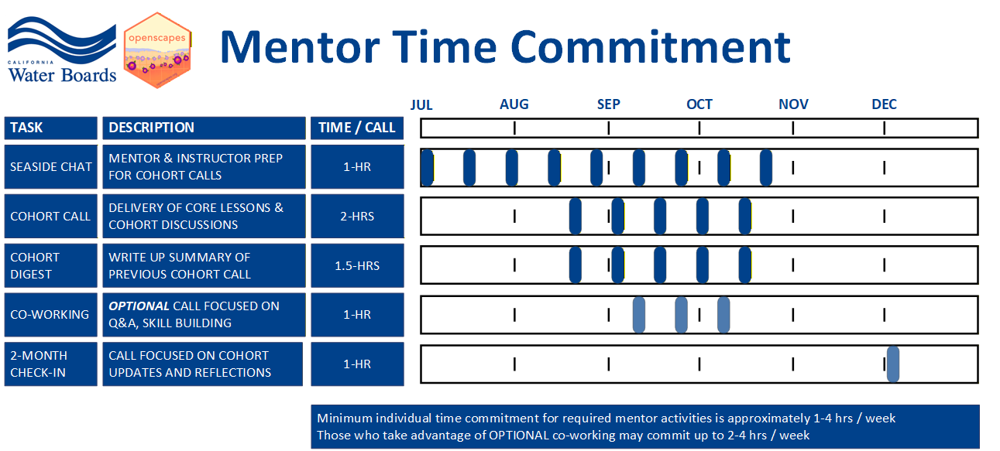

The Openscapes Champions Program is a remote-by-design, cohort-based mentorship program that supports individuals and teams to re-imagine data workflows and stewardship as a collaborative effort, develop modern skills that are of immediate value to them, and cultivate collaborative and inclusive communities. You can participate in the Mentor Community in one of two ways: as a [Cohort Mentor](https://cawaterboarddatacenter.github.io/swrcb-openscapes/mentors/mentor_guidance.html#cohort-mentors) or as a [Community Mentor](https://cawaterboarddatacenter.github.io/swrcb-openscapes/mentors/mentor_guidance.html#community-mentors).

Regardless of which Mentor path you choose, you can contribute to positive culture change and evolution within the Water Boards organization - a culture that continues to move towards embracing open data science practices and tools that are underpinned by principles of equity, inclusion, and kindness.

Characteristics of individuals that will get the most return on their investment into the Mentors Community include:

-   Individuals who are curious, interested in learning about Openscapes, and open to trying new things!
-   Individuals who are interested in exploring the interconnected nature of open science and in taking time to re-imagine data workflows and stewardship as a collaborative effort, develop modern skills that are of immediate value to them, and cultivate collaborative, inclusive, equitable, and kind teams and communities.

## Cohort Mentors

Cohort Mentors are critical to the success of each annual Openscapes cohort as they support the logistical and behind the scenes work required facilitate and support teams and individuals within each cohort (e.g. note taking, breakout rooms). This form of mentorship requires supervisor approval, and a detailed time commitment further described below. For more information regarding detailed onboarding please see [Mentor Onboarding.](https://cawaterboarddatacenter.github.io/swrcb-openscapes/mentors/mentor_onboarding.html)

*The best part of being a Cohort Mentor* is that they get all of the exposure to Openscapes concepts, process, and larger community - without having to find additional time to meet with a team and complete the Pathway!

### Cohort Mentor Requirements

No preparation or skill set is required to be a Cohort Mentor at the Water Boards - we'll onboard folks and teach them everything they need to know.

Anyone across all Water Boards Regions, Divisions, or Offices, and job classifications can become a Cohort Mentor.

The [**ONLY requirement**]{.underline} is that mentors are given the approval and support they need from their management to dedicate the [**time required to actively support and engage in the Openscapes Champions Process**]{.underline}.

### Cohort Mentor Time Commitment

As a Cohort Mentor, the time commitment is similar to [cohort participants](https://cawaterboarddatacenter.github.io/swrcb-openscapes/cohorts/team_guidance.html#participant-requirements), with a few extra assignments., which will require 1 to 4 hours per week. See the Mentor Time Commitment graphic below for more details.

2026 Cohort Mentors will begin meeting with the instruction team via Seaside Chats the first week of July. This time will be used to onboard mentors into the process and prepare them to support Champions Cohort Calls, which will begin mid-August.

**Mandatory** Cohort Mentor Seaside chats will occur every other week on the following days/times:

-   [Tue AM Cohort](https://cawaterboarddatacenter.github.io/swrcb-openscapes/cohorts/swrcb_2026T.html) Mentor Seaside Chats - Tuesdays from 10 am - 11 am, beginning July 7
-   [Wed PM Cohort](https://cawaterboarddatacenter.github.io/swrcb-openscapes/cohorts/swrcb_2026W.html) Mentor Seaside Chats - Wednesdays from 2 pm - 3 pm beginning July 8

## Community Mentors

Community Mentors are also critical to the success and ongoing support of Openscapes at the Water Boards. If you have already engaged in the Openscapes Community at the Water Boards by particiating in a past Openscapes Champions Cohort as an individual or team member, or as a Cohort Mentor, you can continue to participate in Openscapes as a Community Mentor!

Community Mentors support the Openscapes team through contributing to annual Community Calls, general outreach, and ongoing information sharing and skill building.

### Community Mentor Requirements

Community Mentors must have participated in a past Openscapes Champions cohort as a participant or a mentor.

### Community Mentor Time Commitment

As a Community Mentor, you will have more flexibility regarding how and when you choose to support the Water Boards Openscapes community. On average, we recommend minimally attending 1-2 co-working sessions and/or a Community Call.

During the co-working sessions you may decide to support the team through continued outreach, documentation development, and general information sharing. We estimate the time commitment averaging 5-15 hours annually at your discretion.
